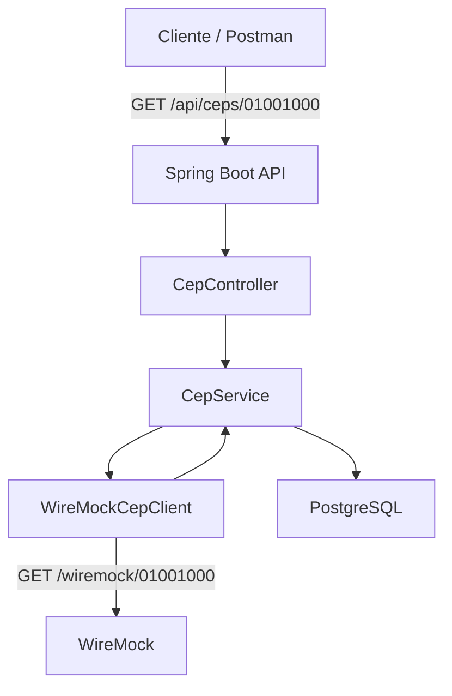

## Desenho da solução

A aplicação foi desenvolvida em Java com Spring Boot e tem como objetivo consultar informações de endereço a partir de um CEP.

O fluxo da solução é:

1. O cliente realiza uma requisição `GET /api/ceps/{cep}`.
2. O `CepController` recebe a requisição e encaminha para o `CepService`.
3. O `CepService` valida e normaliza o CEP informado.
4. O `WireMockCepClient` realiza a chamada para uma API externa mocada com WireMock.
5. O WireMock retorna os dados do endereço.
6. A aplicação grava um log da consulta no PostgreSQL, contendo o CEP, dados retornados e horário da consulta.
7. A API retorna os dados do endereço para o cliente.
